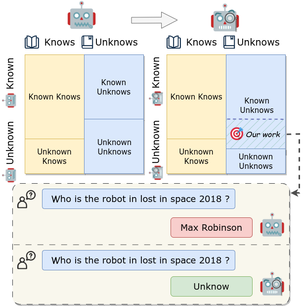

# Teaching Large Language Models to Express Knowledge Boundary from Their Own Signals
This is the official repository for [Teaching Large Language Models to Express Knowledge Boundary from Their Own Signals](https://arxiv.org/abs/2406.10881)
## Overview
Large language models (LLMs) have achieved great success, but their occasional content fabrication, or hallucination, limits their practical application.
Hallucination arises because LLMs struggle to admit ignorance due to inadequate training on knowledge boundaries.
We call it a limitation of LLMs that they can not accurately express their knowledge boundary, answering questions they know while admitting ignorance to questions they do not know.
In our work, we aim to teach LLMs to recognize and express their knowledge boundary, so they can reduce hallucinations caused by fabricating when they do not know.
We propose CoKE, which first probes LLMs' knowledge boundary via internal confidence given a set of questions, and then leverages the probing results to elicit the expression of the knowledge boundary.
Extensive experiments show CoKE helps LLMs express knowledge boundaries, answering known questions while declining unknown ones, significantly improving in-domain and out-of-domain performance.


## Citation
If you find our work useful, please cite our paper:
```
@article{chen2024teaching,
  title={Teaching Large Language Models to Express Knowledge Boundary from Their Own Signals},
  author={Chen, Lida and Liang, Zujie and Wang, Xintao and Liang, Jiaqing and Xiao, Yanghua and Wei, Feng and Chen, Jinglei and Hao, Zhenghong and Han, Bing and Wang, Wei},
  journal={arXiv preprint arXiv:2406.10881},
  year={2024}
}
```